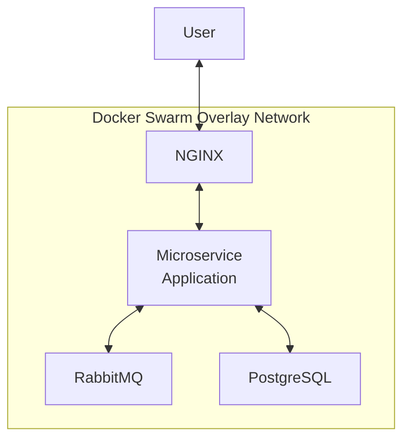
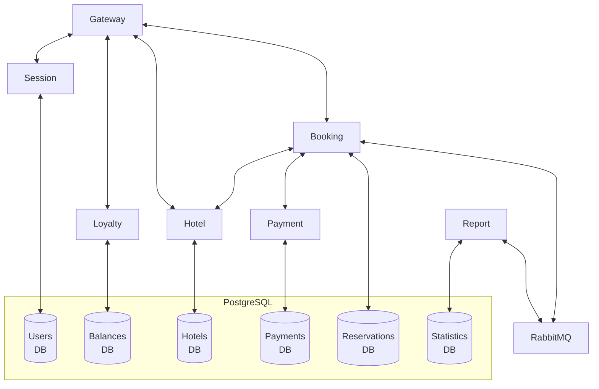

# Docker Swarm Microservice Deployment

[🇷🇺 Русская версия](README_RU.md)

This project demonstrates the deployment of a Java Spring Boot microservice application on a three-node Docker Swarm cluster. Each microservice is containerized using a dedicated Dockerfile, and the resulting images are published to Docker Hub for deployment.

The infrastructure is provisioned with Vagrant. The application stack includes PostgreSQL, RabbitMQ, and NGINX.

This project provided hands-on experience with the basic principles of container orchestration, service scaling, overlay networking, and automated deployment in a reproducible local environment. 

## Technologies

- Docker
- Docker Swarm
- Docker Hub
- Java Spring Boot
- PostgreSQL
- RabbitMQ
- NGINX
- Postman/Newman
- Portainer
- Vagrant
- Bash

## Implementation Highlights

- Created a dedicated Dockerfile for each microservice
- Built and published Docker images to Docker Hub
- Provisioned the environment using Vagrant
- Created a Docker Compose file for the application stack
- Configured NGINX as a reverse proxy
- Deployed the application in a three-node Docker Swarm cluster
- Added script for API testing with Postman/Newman
- Added Portainer stack for Swarm cluster management

## Architecture

**Service topology**



**Microservices architecture**



**Container distribution across nodes**

```text
┌───────────────────────────────┐
│ Manager Node                  │
│-------------------------------│
│ PostgreSQL                    │
│ RabbitMQ                      │
│ NGINX                         │
│ Portainer                     │
└───────────────────────────────┘

┌───────────────────────────────┐
│ Worker Node 1                 │
│-------------------------------│
│ Gateway Service               │
│ Session Service               │
│ Booking Service               │
│ Hotel Service                 │
│ Payment Service               │
│ Loyalty Service               │
│ Report Service                │
└───────────────────────────────┘

┌───────────────────────────────┐
│ Worker Node 2                 │
│-------------------------------│
│ Gateway Service               │
│ Session Service               │
│ Booking Service               │
│ Hotel Service                 │
│ Payment Service               │
│ Loyalty Service               │
│ Report Service                │
└───────────────────────────────┘
```

### Usage

**Requirements**

- At least 4 GB of RAM
- VirtualBox
- Vagrant

1. Clone the repository and navigate to the project directory.

2. Start the virtual machines using Vagrant:

```bash
vagrant up
```

3. Connect to the manager node:

```bash
vagrant ssh manager01
```

4. Deploy the microservice application stack:

```bash
docker stack deploy -c ./app_src/microservice_app_compose.yml microservice_app
```

Monitor the deployment status with:

```bash
docker stack ps microservice_app
```

5. After all containers are running, run the API tests:

```bash
bash ./app_src/postman_tests/newman_run.sh
```

6. Deploy the Portainer stack:

```bash
docker stack deploy -c ./app_src/portainer_compose.yml portainer
```

Monitor the deployment status with:

```bash
docker stack ps portainer
```

7. Access Portainer from your host machine:

[https://127.0.0.1:9443/](https://127.0.0.1:9443/)
