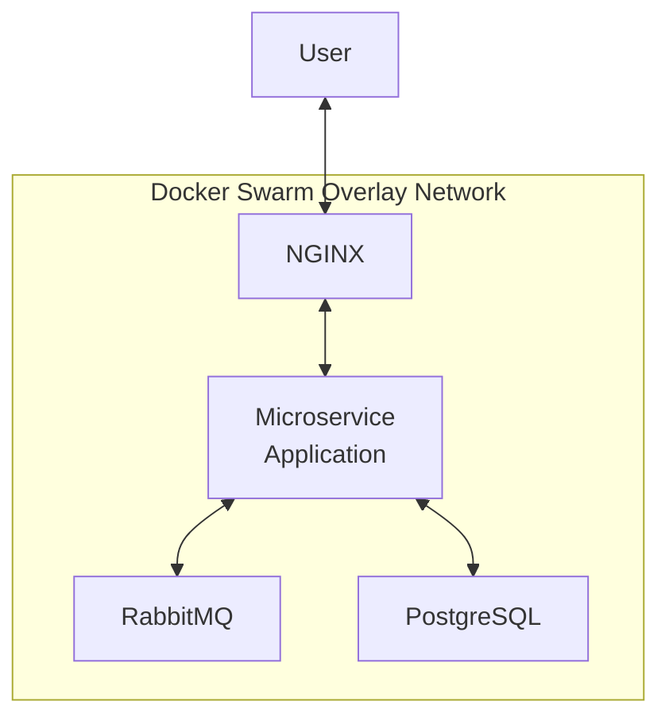
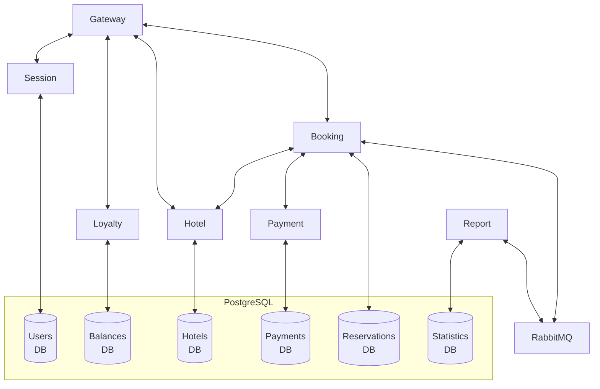

# Docker Swarm Microservice Deployment

[🇬🇧 English version](README.md)

Проект демонстрирует развертывание микросервисного приложения на Java Spring Boot в кластере Docker Swarm, состоящем из трёх виртуальных машин. Для каждого микросервиса создан Dockerfile, а собранные образы загружены в Docker Hub.

Для создания и подготовки виртуальных машин к развертыванию используется Vagrant. Стек приложения включает PostgreSQL, RabbitMQ и NGINX.
 
## Используемые технологии

- Docker
- Docker Swarm
- Docker Hub
- PostgreSQL
- RabbitMQ
- NGINX
- Postman/Newman
- Portainer
- Vagrant
- Bash

## Шаги реализации

- Написан Dockerfile для сборки каждого из микросервисов
- Собранные образы загружены в Docker Hub
- С помощью Vagrant развернуто локальное окружение
- Создан Docker Compose-файл для стека микросервисного приложения
- Настроен NGINX в качестве реверс-прокси
- Приложение развернуто в кластере Docker Swarm
- Создан скрипт для автоматизированного тестирования API с помощью Postman/Newman
- Развернут Portainer для управления кластером Docker Swarm

## Архитектура

**Топология сервисов**



**Архитектура микросервисного приложения**



**Размещение контейнеров между нодами**

```text
┌───────────────────────────────┐
│ Manager Node                  │
│-------------------------------│
│ PostgreSQL                    │
│ RabbitMQ                      │
│ NGINX                         │
│ Portainer                     │
└───────────────────────────────┘

┌───────────────────────────────┐
│ Worker Node 1                 │
│-------------------------------│
│ Gateway Service               │
│ Session Service               │
│ Booking Service               │
│ Hotel Service                 │
│ Payment Service               │
│ Loyalty Service               │
│ Report Service                │
└───────────────────────────────┘

┌───────────────────────────────┐
│ Worker Node 2                 │
│-------------------------------│
│ Gateway Service               │
│ Session Service               │
│ Booking Service               │
│ Hotel Service                 │
│ Payment Service               │
│ Loyalty Service               │
│ Report Service                │
└───────────────────────────────┘
```

## Порядок запуска

**Требования к системе**

- Не менее 4 GB ОЗУ
- VirtualBox
- Vagrant

**Этапы запуска**

1. Склонируйте репозиторий и перейдите в его корневую директорию.

2. Запустите виртуальные машины, используя Vagrant:

```bash
vagrant up
```

3. Подключитесь к manager-ноде:

```bash
vagrant ssh manager01
```

4. Разверните стек микросервисного приложения:

```bash
docker stack deploy -c ./app_src/microservice_app_compose.yml microservice_app
```

Проверить статус развертывания стека можно с помощью:

```bash
docker stack ps microservice_app
```

5. Дождитесь, пока все контейнеры стека перейдут в состояние Running, затем выполните API-тесты:

```bash
bash ./app_src/postman_tests/newman_run.sh
```

6. Разверните стек Portainer:

```bash
docker stack deploy -c ./app_src/portainer_compose.yml portainer
```

Проверить статус развертывания стека можно с помощью:

```bash
docker stack ps portainer
```

7. Дождитесь, пока все контейнеры стека перейдут в состояние Running, после чего откройте Portainer по адресу:

[https://127.0.0.1:9443/](https://127.0.0.1:9443/)
