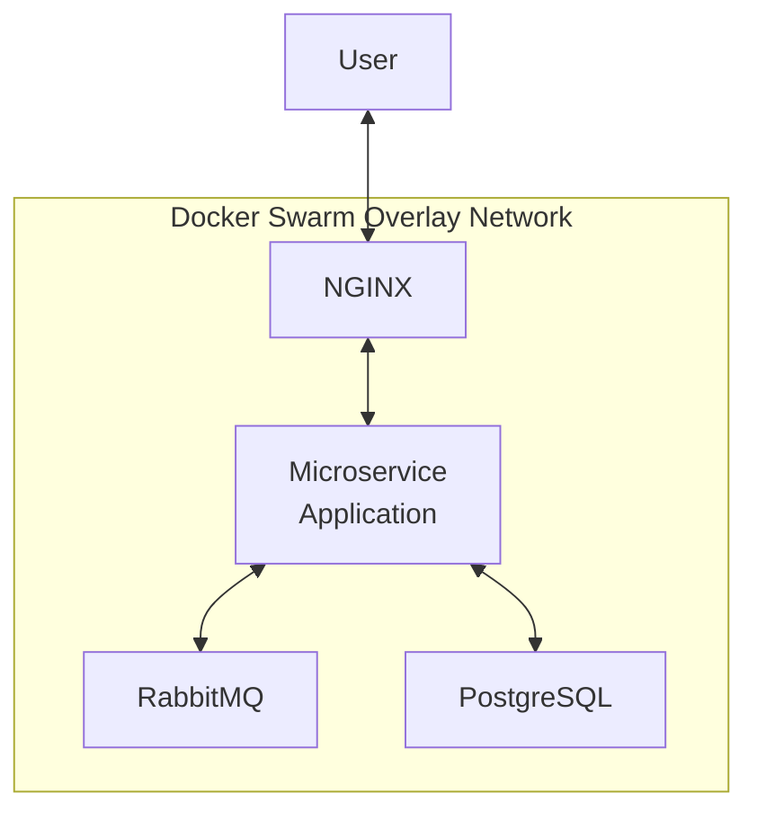
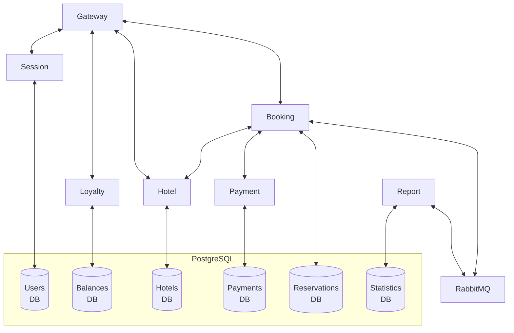

# Docker Swarm Microservice Deployment

[🇬🇧 English version](README.md)

Проект демонстрирует развертывание микросервисного Java Spring Boot-приложения в Docker Swarm кластере из трёх виртуальных машин. Для каждого микросервиса написан Dockerfile, и итоговый образ загружен в Docker Hub.

Создание и подготовка виртуальных машин к деплою осуществляется с помощью Vagrant. Стек приложения включает в себя PostgreSQL, RabbitMQ и NGINX.

Целями разработки проекта были изучение основ контейнерной оркестрации, масштабирования сервисов, работы оверлейных сетей, а так же автоматического деплоймента в воспроизводимом окружении.
 
## Стек примененных технологий

- Docker
- Docker Swarm
- Docker Hub
- Java Spring Boot
- PostgreSQL
- RabbitMQ
- NGINX
- Postman/Newman
- Portainer
- Vagrant
- Bash

## Шаги реализации

- Написан Dockerfile для сборки каждого из микросервисов
- После сборки образы запушены в Docker Hub
- При помощи Vagrant развернуто локальное окружение 
- Написан Docker Compose для стека микросервисного приложения
- Создана конфигурация NGINX для использования в качестве реверс-прокси
- Приложение развернуто в Docker Swarm кластере
- Написан скрипт для быстрого тестирования API приложения с помощью Postman/Newman
- Развернут стек Portainer для управления Docker Swarm кластером

## Архитектура

**Топология сервисов**



**Архитектура микросервисного приложения**



**Размещение контейнеров между нодами**

```text
┌───────────────────────────────┐
│ Manager Node                  │
│-------------------------------│
│ PostgreSQL                    │
│ RabbitMQ                      │
│ NGINX                         │
│ Portainer                     │
└───────────────────────────────┘

┌───────────────────────────────┐
│ Worker Node 1                 │
│-------------------------------│
│ Gateway Service               │
│ Session Service               │
│ Booking Service               │
│ Hotel Service                 │
│ Payment Service               │
│ Loyalty Service               │
│ Report Service                │
└───────────────────────────────┘

┌───────────────────────────────┐
│ Worker Node 2                 │
│-------------------------------│
│ Gateway Service               │
│ Session Service               │
│ Booking Service               │
│ Hotel Service                 │
│ Payment Service               │
│ Loyalty Service               │
│ Report Service                │
└───────────────────────────────┘
```

## Запуск и использование

**Требования к системе**

- Не менее 4 GB ОЗУ
- VirtualBox
- Vagrant

**Этапы запуска**

1. Склонируйте репозиторий и перейдите в его корневую директорию.

2. Запустите виртуальные машины, используя Vagrant:

```bash
vagrant up
```

3. Подключитесь к manager-ноде:

```bash
vagrant ssh manager01
```

4. Разверните стек микросервисного приложения:

```bash
docker stack deploy -c ./app_src/microservice_app_compose.yml microservice_app
```

Вы можете отслеживать статус развертывания стека с помощью:

```bash
docker stack ps microservice_app
```

5. После того, как все контейнеры стека перейдут в состояние Running, выполните API-тесты:

```bash
bash ./app_src/postman_tests/newman_run.sh
```

6. Разверните стек Portainer:

```bash
docker stack deploy -c ./app_src/portainer_compose.yml portainer
```

Вы можете отслеживать статус развертывания стека с помощью:

```bash
docker stack ps portainer
```

7. После того, как все контейнеры стека перейдут в состояние Running, откройте веб-страницу Portainer. Для этого перейдите по следующей ссылке:

[https://127.0.0.1:9443/](https://127.0.0.1:9443/)
